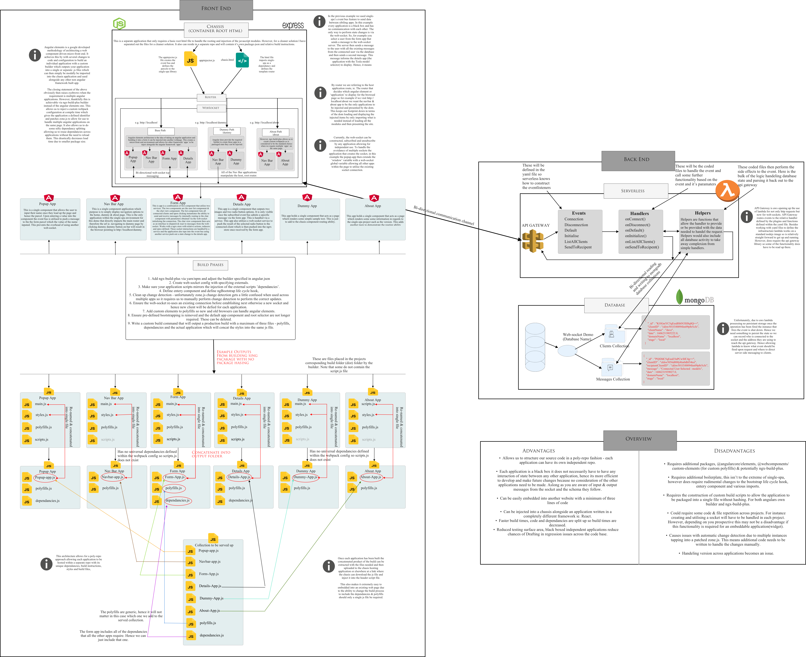

# Angular-elements-tracer

General Info:
Angular-elements-tracer - This is an application I developed whilst researching into micro-frontends. It is extremely primitive but was built as more of a proof of concept of how server less lambda web sockets could bidirectionally communicate to separate angular projects (application). This means even though on here they are stored in one repo they have the potential to each possess their own repo (i.e., each folder name is a repo) due to the fact they each have independent dependencies &amp; build commands.

This project utilises angular elements architecture alongside ngx-build-plus to handle the ability of implementing multiple applications onto the same page via custom patching in terms of zonejs and identifiers. ngx-build-plus also allows us extra packaging functionality upon building the project that allows us to remove hashing, separate out styles, application and with the use of a custom webpack config the dependencies too.

On top of the interesting functionality in encompassing application injection into a root HTML application (in this project known as the 'chassis'). A couple of the application leverage ngrx to store global state within them. This ultimately means that once a message is received by the web socket service it fires an action with payload for the ngrx store to handle and reduce into new, deleted or updated state. This state is then an observable stream that can be subscribed to or &amp; asynchronously piped and handled within the template html.

This chassis application has been coded very simplistically with a basic html element level router to handle dynamic module injection and utilises a simple express server to serve up the static site and accompanying built app js files. However, this could be replaced as another angular host application to allow for built in rooting capability and accessibility to more functionality. Also, in production these 'built' js files will most likely served away at a different URL which would still work.

Another interesting factor investigated within the project is unlike the sing-spa implementation it uses web sockets as a sole source of interaction between each other. The current ideology of implementation of this is to use a web socket service on each application which reuses existing connections if it exists by adding the socket to a global 'window' level variable.

Overall, combining all these things gave a good scope of what is possible with micro-frontends and the whole notion of single page applications so ended up to be an extremely useful bare bones demo to reference when constructing more complex systems based on the same infrastructure. The use of the sole WebSocket communication system shone a light on the possibilities in regards to keeping each application pure and black box like, which is useful because the project may fit this schema of communication well when each application will be heavily dependent on web sockets anyway.

The serverless web sockets functionality is stored under another repo and will be required to run the project. You can find that here https://github.com/TJSTONE99/AWS-Serverless-websocket-mongo-interaction. Select the other branch from the master. The master branch holds code specific for the single-spa implementation.

I also have created a bassic diagram to illustrate the whole architecture from start to finish. However, I will re-itterate this was mainly thrown together so its far from great but a good reference for future use with angular elements and the notion of micro-front-ending.

Installation:

    •   To run the project, open a new terminal with node installed (I used node 13.12.0 for development) and navigate to the directory containing the project folders.
    •   Now cd into each folder and run the command `npm install` - to install all node_module dependencies listed in the package.json file
    •   Next run the command `npm run build:webelem`
    •   Repeat this for each app (each folder within the root driectory of this repo if you haven't moved anything) excluding the chassis application.
    •   This will output the built files to the directory 'output' with each corresponding project root folders. A couple of the apps may give errors in regards to styles.js these can be ignored it just means the application has no defined styles within the root style sheet (style.css at the project root) and hence has just built the core app js file.
    •   Now copy the application js file. ie. if the built project is Form-App then the application file will be called 'Form-App.js'
    •   Paste this into the Chasis app components folder & repeat for all other built applications. Now copy the 'dependancies.js' & 'polyfills.js' files from the Form-App output folder into the components folder within the Chasis app. This is because the form app encomposes all of the dependancies all the other applications are utilising and these files need to only be created once in the host app.
    •   Now cd into the chassis application folder and run the command `npm run start`. This will serve the content via node and express to http://localhost:8000

Other considerations:
• environmental variables are stored in the environments folder within each angular project the only thing that may need to be adjusted here is the `websocketConnectionURL` property if your serverless websocket has been instantiated at a different url/port.
• All the code to mount/unmounted applications is within the Chassis injector.js file.
